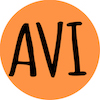

# AVI: a virtual pet for children with NF
AVI is a longitudinal data collection app for children with Neurofibromatosis and their parents and guardians. AVI makes it easy and accessible to log symptoms, provide customized information for the caregivers, and encourage children to communicate their conditions openly and in an engaging way.

## Introduction
Neurofibromatosis manifests itself in many different symptoms, making it challenging to obtain longitudinal data of the development of potential symptoms through standard questionnaires. It also puts a significant burden on caregivers, parents, and guardians to look out for many possible complications without ways to selectively focus their attention when observing their child's symptoms. Moreover, because Neurofibromatosis is such a rare disease, children may find it difficult to openly communicate their conditions due to feeling isolated and different from their peers.

## Methods
We approached these problems with three goals in mind.
***1. We want to help children with NF accept and be proud of who they are regardless of their medical condition***
- We created AVI, a virtual pet for children with NF! Avi serves as a companion to help incentivize the child to communicate their feelings and symptoms. As kids log entries consistently, Avi grows and thrives. Avi will develop brighter fur, new facial expressions, and more animation. If the log is neglected, Avi decreases in size and vibrancy. It is the child’s responsibility to care for Avi and, in turn, themselves! 

***2. We want to streamline the process of logging symptoms and make it possible to collect a finer timeline of records to help the NF research community.***
- We develop a one-point entry system where users can log their symptoms and experience as a text description (either by typing or speaking through speech recognition). This text log is then preprocessed and fed into the word embedding model and finds the list of symptoms that are most similar to the input text log. Target symptoms are 60+ symptoms identified in the [CTF NF Patient Registry Dataset](https://www.synapse.org/#!Synapse:syn22684314/wiki/605535). The identified symptoms are stored without user-identifying information in the database to be used for the research community.

***3. We want to help caregivers to make more informed observations that can help them report symptoms to physicians and to recognize any development of complications.***
- Our app computes the list of other potential complications (e.g. brain tumor, social or cognitive disorders) associated with the currently identified symptoms, using the phi-correlation between symptoms from the existing patient data from CTF NF Patient Registry Dataset. This information is available for caregivers, which caregivers can use as additional guidance to stay informed.
- Additionally, the users can add more in-depth log and pictures of skin lesions. When the user uploads a picture of a skin lesion, we classify the lesions using the image classification model to inform the user as well as to optimize the lesion image storage.
- When additional logs are made that confirm a diagnosis of a new condition or melanomas, we retrain our models based on this data.

*You can view codes and our model under RESEARCH folder

## Conclusion/Discussion
AVI is a fun and simple approach to engage children with NF and to collect possibly longitudinal data using NLP and machine learning. We want to provide children with NF a safe place to discuss their symptoms and to feel that they are never in this alone while supporting the research community to end the NF. Currently, our prototype targets children with NF1 diagnosis, but we hope to expand it to the children with risk factors of NF2. This may shed a light on identifying the early signs of development of NF2. 

### Please make sure you address ALL of the following:

#### *1. What additional data would you like to have*
Our app is designed to collect the data it needs on its own. But to validate the diagnostic data and melanomas to reliably include them to update our model, it'd be ideal to collaborate with the physician side platform. 

#### *2. What are the next rational steps?* 
Our app is currently a rough prototype. The immediate next step is to fine-tune the user experience and to host it on a reliable server for further testing and complete data engineering. Please see our **3-Months Plan** section for more details.

#### *3. What additional tools or pipelines will be needed for those steps?*
We need to develop a pipeline to automatically update our models, which will require us to decide how to validate diagnostic data. This may be done as a collaboration with another platform targeting the physician side, or we may need to add functionality where the user's physicians can validate the data during their routine check-ups. 

#### *4. What skills would additional collaborators ideally have?*
As mentioned above, additional collaborators may have more knowledge to develop a physician-side application.

### 3-Months Plan
Please see this document for our 3 months plan: [LINK](https://docs.google.com/document/d/1PI4Vg7HPtnKMQGhNRJHudb3-NnBhCpoE_-IZRypxpt4/edit?usp=sharing)

## Reproduction: *How to reproduce the findings!*

### Docker

*The Docker image contains <R/jupyter> notebooks of all analyses and the dependencies to run them. *Be sure to note if you need any special credentials to access data for these analyses, **don't package restricted data** in your containers!*

Instructions for running the following notebooks: *be sure to adjust these instructions as necessary! check out https://github.com/Sage-Bionetworks/nfhackathon2020/ for example containers and instructions*

1. `docker pull <your dockerhub repo>/<this container>` command to pull the image from the DockerHub
2. `docker run <your dockerhub repo>/<this container>` Run the docker image from the master shell script

### Important Resources *: primary data, github repository, Synapse project, dockerfile link etc.*

